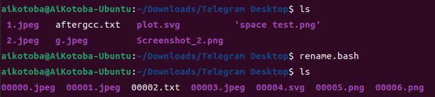

### 写在前面：
1. ##### 本项目仅供个人学习使用，并未考虑防御式编程，且仅在个人设备上测试过，所有代码请务必在限定的文件夹中测试后再运行，以防损失重要文件！
2. ##### 阅读源码前请先确认您有shell script编程的相关知识贮备，例如通读过《Linux命令行大全 第二版》。
3. ##### 脚本测试后应放在home/USERNAME/bin中并确认$PATH中含有该目录再在命令行执行，若无执行权限请使用：
    ```shell
    chmod 755 /home/USERNAME/bin/SCRIPTNAME
    # 将USERNAME和SCRIPTNAME替换为相应用户名和脚本名
    ```


### 开发环境：
##### Ubuntu22.04，Shell(bash)，Visual Studio Code(扩展：shellman、shell-format、ShellCheck)

### 目录：
1. [对文件从00000~99999批量进行编号](#rename)
2. [集成git add、git commit、git push快速进行微小修改提交](#qapp)

### 说明：
1. ### <span id="rename">rename.bash</span>
    * 注意事项：
        - 支持以默认目录(命令行所在目录)和指定目录为目标
        - 目录所含文件名可含有空格
        - 不改写文件名后缀
        - 子目录不会被重命名
        - 无后缀的文件不会被重命名，但是不建议这么做
    * 使用方法：
        ```shell
        :~$ rename.bash
        ```
        或
        ```shell
        :~$ rename.bash diectory/
        ```
    * 效果图：
      


